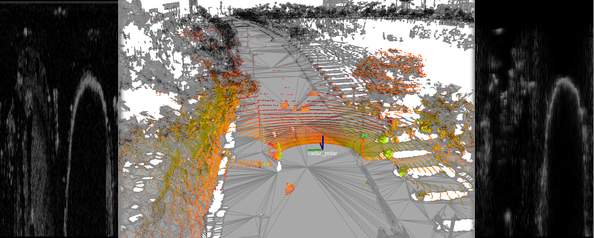
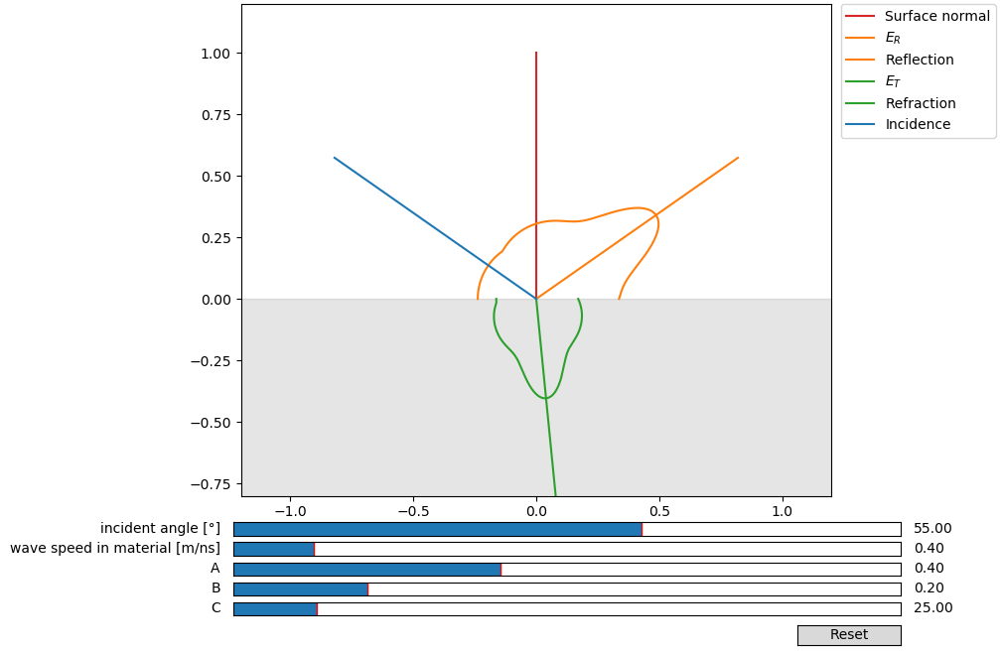

# RadaRays - ROS package

Rotating FMCW radar simulation based on ray-tracing. This package contains all the tools that has been used to simulate radar data and compare it to real sensor data.

## Requirements

- ROS noetic
- Rmagine for ray tracing on CPU or NVIDIA GPUs (RTX or non-RTX): https://github.com/uos/rmagine
- (optional) mesh_tools fork for visualizations: [https://github.com/aock/mesh_tools](https://github.com/aock/mesh_tools)

Mainly tested on:
- Ubuntu 20.04
- AMD Ryzen 7 3800X
- NVIDIA GeForce RTX 2070 SUPER

And others: see paper (preprint is coming soon).

## MulRan

Demonstration of simulating rotating FMCW radar data in large-scale triangle meshes from MulRan datasets. We reconstructed a mesh of the sequences DCC, and KAIST, and added a localization frame to each bag file using MICP-L as described here: [https://github.com/aock/micp_experiments/tree/main/micp_mulran](https://github.com/aock/micp_experiments/tree/main/micp_mulran). The final bag files are piped to RadaRays. The simulation given the localization is started by


```console
roslaunch radarays_ros mulran_sim.launch gui:=false
```

The simulated data is published on topic `/radar/image`. To enable the visualization you will need [https://github.com/aock/mesh_tools](https://github.com/aock/mesh_tools). Then start the same launch file:

```console
roslaunch radarays_ros mulran_sim.launch gui:=true
```

The results should look as follows:



Left is the real radar polar image from the MulRan datasets. Right is the RadaRays simulated polar image.

Videos: https://youtube.com/playlist?list=PL9wBuzh6ev06rcl8ksSnxRtv-7jAkR_wx

## BRDF

Easily customize the models reflection parameters using the following interactive tool:

```console
rosrun radaray_ros radarays_snell_fresnel_brdf.py
```



## Citation

Please reference the following papers when using RadaRays in your scientific work.

- Title: "RadaRays: Real-time Simulation of Rotating FMCW Radar for Mobile Robotics via Hardware-accelerated Ray Tracing"
- Preprint: https://arxiv.org/abs/2310.03505

## Roadmap

1. Cleanup Gazebo-Plugin and publish to Github: [`https://github.com/uos/radarays_gazebo_plugin`](https://github.com/uos/radarays_gazebo_plugin)
2. Put every non-ROS component to C++ only repository ([`https://github.com/uos/radarays`](https://github.com/uos/radarays)) for better reusage for non-ROS projects.

